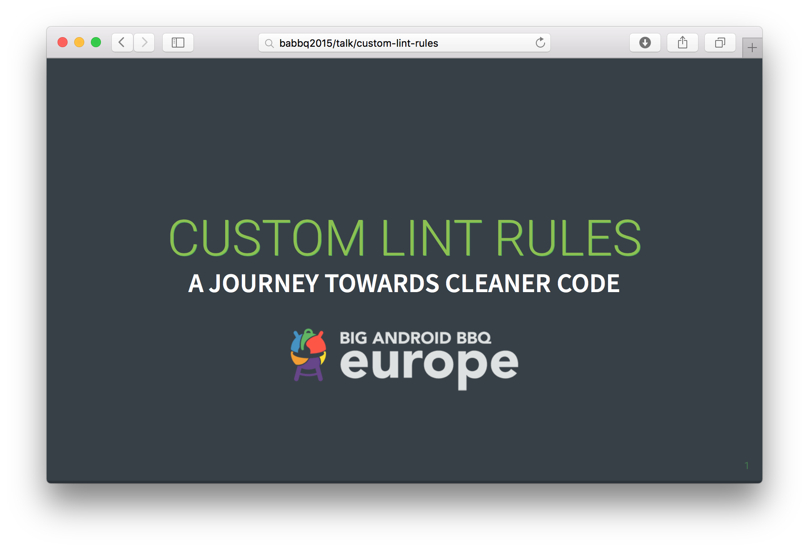

# Custom Lint rules - A journey towards cleaner code



Presented at [BABBQ Amsterdam](http://babbq.nl) on November 12, 2015.

Every Android Developer is using it all the time: Lint. It's deeply integrated into Android Studio and features more than 200 default checks. It's possible to extend this powerful tool, but how?

This talk is a comprehensive summary on how to write, test and operate custom Lint rules.

## How to view?

Find a dynamic version (with animation, ...) of the slides [here](http://a11n.github.io/babbq-slides).

Find a static version of the slides [here](https://speakerdeck.com/a11n/custom-lint-rules-a-journey-towards-cleaner-code).

## How to use?

The slides are presented by [RevealJS](https://github.com/hakimel/reveal.js).

In order to compile this presentation by yourself three simple steps are required:

* Checkout this repo and change into its directory

```shell
git clone https://github.com/a11n/babbq-slides.git
cd babbq-slides
```

* Install Grunt

```shell
npm install -g grunt
```

* Run Grunt

```shell
grunt serve
```

## Shortcuts

|Key|Description|
|------|-----------|
|Arrows|Navigate through the slides.|
|Space |Go to next slide.|
|ESC   |Display overview.|
|F     |Enter fullscreen mode.|
|S     |Open speaker view (with timer and notes).|


## License
&copy;2015 André Diermann

[](http://creativecommons.org/licenses/by-nc-sa/4.0/)

This work is licensed under a Creative Commons Attribution-NonCommercial-ShareAlike 4.0 International License.
