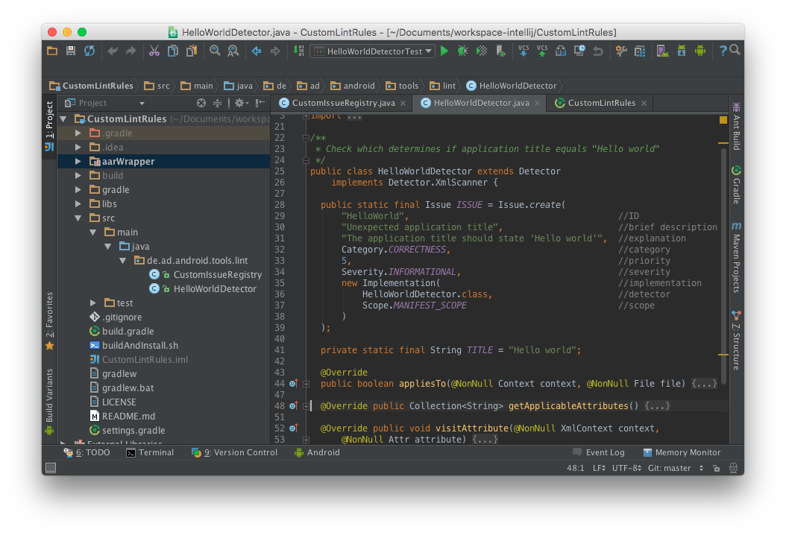

#Custom Lint rules <!-- .element: style="font-size: 2.4em;" -->
###A journey towards cleaner code
<!-- .element: style="position: absolute; left:0; right:0; margin-left:auto; margin-right:auto;" -->
--
<!-- .element: style="float: left; width: 200px; height: 200px; border-radius: 100px; margin-right: 14px;" -->
#André Diermann<!-- .element: style="font-size: 2.1em;" -->
Software Architect @<!-- .element: style=" margin: 0 0;" --> [it-objects](http://www.it-objects.de)
--
#Agenda
* Introduction
* Creation
* Verification
* Operation
* Q & A
--
#Introduction
* Lint
* Custom rules
---
#Lint
* tool for command-line and IDE <!-- .element: class="fragment" data-fragment-index="0" -->
* scans all kind of development artifacts <!-- .element: class="fragment" data-fragment-index="1" -->
* reports potential bugs, bad coding habits, broken conventions, ... <!-- .element: class="fragment" data-fragment-index="2" -->
* features more than 200 built-in checks (October 2015) <!-- .element: class="fragment" data-fragment-index="3" -->
---
##Example

---
##Example
 <!-- .element: style="max-width: 90%; height: auto;" -->
---
#Custom rules
##Motivation
* work in large and distributed teams requires dedicated conventions <!-- .element: class="fragment" data-fragment-index="0" -->
* huge code bases require automated checks <!-- .element: class="fragment" data-fragment-index="1" -->
* need for 'Android specific' validations<br/> (vs. checkstyle, FindBugs, ...) <!-- .element: class="fragment" data-fragment-index="2" -->
* ... <!-- .element: class="fragment" data-fragment-index="3" -->
--
#Creation
* Project setup
* Lint API
---
#Project setup
https://github.com/a11n/CustomLintRules <!-- .element: class="fragment" data-fragment-index="1" -->
 <!-- .element: style="max-width: 80%; height: auto;" -->
---
<!-- .slide: data-transition="slide-in fade-out" -->
#Lint API
<br/>
 <!-- .element: style="max-width: 80%; height: auto;" -->
---
<!-- .slide: data-transition="fade-in slide-out" -->
#Lint API
https://github.com/a11n/android-lint <!-- .element: class="fragment" data-fragment-index="1" -->
 <!-- .element: style="max-width: 80%; height: auto;" -->
---
#Lint API
##Issue
```java
 public static final Issue ISSUE = Issue.create(
    "HelloWorld",                                 //ID
    "Unexpected application title",               //brief description
    "The application title should"                //explanation
      + "state 'Hello world'",
    Category.CORRECTNESS,                         //category
    5,                                            //priority
    Severity.INFORMATIONAL,                       //severity
    new Implementation(                           //implementation
        HelloWorldDetector.class,                 //detector
        Scope.MANIFEST_SCOPE                      //scope
    )
);
```
---
#Lint API
##Detector
```java
public class HelloWorldDetector extends Detector
 implements XmlScanner {

  public static final Issue ISSUE = Issue.create(...);

  @Override public Collection<String> getApplicableElements() {...}

  @Override public Collection<String> getApplicableAttributes() {...}

  @Override public void visitElement(@NonNull XmlContext context,
      @NonNull Element element) {...}

  @Override public void visitAttribute(@NonNull XmlContext context,
      @NonNull Attr attribute) {...}
}
```
---
#Lint API
##Scanner
* `JavaScanner`
* `ClassScanner`
* `BinaryResourceScanner`
* `ResourceFolderScanner`
* `XmlScanner`
* `GradleScanner`
* `OtherFileScanner`
---
#Lint API
##Scanner
|JavaScanner|XmlScanner|
|-----------|----------|
|`applicableSuperClasses()`|`getApplicableElements()`|
|`checkClass(...)`|`visitElement(...)`|
|`getApplicableMethodNames()`|`getApplicableAttributes()`|
|`visitMethod(...)`|`visitAttribute(...)`|
|...|...|
---
#Lint API
##IssueRegistry
```java
public class CustomIssueRegistry extends IssueRegistry {
  @Override
  public List<Issue> getIssues() {
    return Arrays.asList(             //Note:
      MyCustomCheck.ISSUE,            //A check actually is a detector.
      MyAdvancedCheck.AN_ISSUE,       //One detector can report
      MyAdvancedCheck.ANOTHER_ISSUE   //multiple types of issues.
    );
  }
}
```
--
#Verification
* Testing
* Debugging
---
#Testing
* Test
* Assert
* JUnit4
---
#Test
```java
public class HelloWorldDetectorTest extends LintDetectorTest {
  //Specify the detector under test
  @Override protected Detector getDetector() { ... }

  //Specify the issues to report
  @Override protected List<Issue> getIssues() { ... }

  //Perform test
  public void test() throws Exception {
    //assert that linting a given set of files
    //returns the expected output
    assertEquals(EXPECTED_OUTPUT, lintFiles(FILES));
  }
}
```
---
#Assert
Lint test library only allows assertion of `Strings`.
```java
public void testShouldDetectWarning() throws Exception {
  assertEquals(
    "AndroidManifest.xml:8: Information: Unexpected title \"@string/app_name\". Should be \"Hello world.\". [HelloWorld]\n"
  + "        android:label=\"@string/app_name\"\n"
  + "        ~~~~~~~~~~~~~~~~~~~~~~~~~~~~~~~~\n"
  + "0 errors, 1 warnings\n",
    lintFiles("InvalidAndroidManifest.xml=>AndroidManifest.xml"));
}
```

<blockquote class="fragment" data-fragment-index="1"><b>#ProTip:</b> Let the test fail first and copy the assertion error to get the expected output.</blockquote>
---
#Assert
Two options for test data
* Inline resources <!-- .element: class="fragment" data-fragment-index="1" -->

<pre class="fragment" data-fragment-index="1"><code data-trim class="lang-java">
assertEquals("No warnings.",
  lintProject(
    xml("AndroidManifest.xml", "..."),
    java("src/main/java/test/MainActivity.java", "..."),
    ...));
</code></pre>

* External resources <!-- .element: class="fragment" data-fragment-index="2" -->

<pre class="fragment" data-fragment-index="2"><code data-trim class="lang-java">
assertEquals("No warnings.",
  lintFiles(
    "ValidAndroidManifest.xml=>AndroidManifest.xml", ...));
</code></pre>
---
#JUnit4
The official Android Lint test library only<br/> supports JUnit3 style.
* You have to extend `LintDetectorTest` and
* prefix your test methods with `test`.

---
#lint-junit-rule
###Motivation
* usage of JUnit4
* better assertions

> https://github.com/a11n/lint-junit-rule

---
#Example
```java
//Setup Detector and Issues
@Rule public Lint lint =
    new Lint(new MyCustomDetector(), MyCustomDetector.ISSUE);

@Test
public void test() throws Exception {
  //Lint the specified files from your test resources
  List<Warning> lintResult =
      lint.files("AndroidManifest.xml", "res/values/strings.xml");

  //Assertions
  //...
}
```
---
#Example
```java
//AssertJ
assertThat(lintResult)
  .hasWarnings(2)
  .in("AndroidManifest.xml", "strings.xml")
  .atLine(8, 14)
  .withMessage("MyCustomDetector warning message.",
                "MyCustomDetector warning message.");

//Hamcrest
assertThat(lintResult,
            hasWarnings(
              in("AndroidManifest.xml", "strings.xml"),
              atLine(8, 14),
              withMessage("MyCustomDetector warning message.",
                          "MyCustomDetector warning message.")));
```
---
#Debugging
* during testing
* during Gradle run
---
##Debugging during testing
Works out of the box in IntelliJ and Android Studio.

---
##Debugging during Gradle run
Credits to [Marc Prengemann](https://speakerdeck.com/winterdroid/better-code-through-lint-and-checkstyle?slide=58)
* Add to `gradle.properties`
```groovy
org.gradle.jvmargs=
    '-agentlib:jdwp=transport=dt_socket,server=y,suspend=n,address=5005'
```
* Start Gradle Daemon
```bash
./gradlew --daemon
```
---
##Debugging during Gradle run
* Add and run new remote debug configuration

* Run Lint on your application project
```bash
./gradlew lint
```
---
##Debugging during Gradle run

--
#Operation
* Configuration
* Application
* Continuous Integration
* Discovery
---
#Configuration
Lint can be configured in different ways and <br/ >at different levels using:
* Gradle
* File
* Other
---
##Gradle-based configuration
```groovy
android {
    lintOptions {
       // set to true to turn off analysis progress reporting by lint
       quiet true
       // if true, stop the gradle build if errors are found
       abortOnError false
       // if true, only report errors
       ignoreWarnings true
       }
       ...
    }
```
Complete [list of Lint options](http://tools.android.com/tech-docs/new-build-system/user-guide#TOC-Lint-support).
---
##File-based configuration
`lint.xml` in the root directory of the Android project
```xml
<?xml version="1.0" encoding="UTF-8"?>
<lint>
    <!-- Disable the given check in this project -->
    <issue id="IconMissingDensityFolder" severity="ignore" />

    <!-- Ignore the ObsoleteLayoutParam issue in the specified files -->
    <issue id="ObsoleteLayoutParam">
        <ignore path="res/layout/activation.xml" />
        <ignore path="res/layout-xlarge/activation.xml" />
    </issue>

    <!-- Change the severity of hardcoded strings to "error" -->
    <issue id="HardcodedText" severity="error" />
</lint>
```
---
#Other
* in Java
```java
@SuppressLint("TheIssueYouWantToSuppress")
```

* in XML
```xml
xmlns:tools="http://schemas.android.com/tools"
tools:ignore="TheIssueYouWantToSuppress"
```

---
#Application
* Basic approach
* Integrated approach
---
#Basic approach
* utilizes basic Lint extension feature
* two steps setup
 1. assemble custom Lint rules into JAR
 2. copy JAR to `~/.android/lint/`
---
#Integrated approach
Credits to [Cheng Yang](https://engineering.linkedin.com/android/writing-custom-lint-checks-gradle)
* uses AAR bundle as wrapper
* two steps setup
 1. wrap custom Lint rules into an AAR
 2. make application project depend on that AAR
---
#Continuous Integration
> Lint should be integrated into the Continuous Integration process!

---
#Recommendations <!-- .element: style="font-size: 2.3em;" -->
* Be strict
* Be verbose
* Evolve team culture
---
#Example
https://github.com/a11n/docker-jenkins-android-lint
 <!-- .element: style="max-width: 85%; height: auto;" -->
---
#Example

---
#Discovery
##Background
* Linting a pure scaffolded application project discovers **~50 Lint violations**
* Running Lint on a real world project *discovers*<br/> **>5000 Lint violations**

<br/>
<blockquote class="fragment" data-fragment-index="1"><b>Challenge:</b><br/>Discover relevant information.</blockquote>
---
#Discovery
##Lint-Graph
https://github.com/a11n/lint-graph

---
#Discovery
##Lint-Browser
> <i class="fa fa-frown-o"></i> Not open-sourced yet.<i class="fa fa-frown-o"></i>

* Angular Material front-end
* parses `lint-results.xml`
* allows grouping, filtering, sorting, ...
* supports discovery of relations, potential sources, ... of issues.
--
#Future work
* Custom `SupportAnnotations`
* Custom `QuickFixes`
* Kotlin support
* ...
--
### Thank you for your attention.

# Q&A

<i class="fa fa-twitter"></i><a href="https://twitter.com/q2ad">q2ad</a>
<i class="fa fa-github"></i><a href="https://github.com/a11n">a11n</a>
